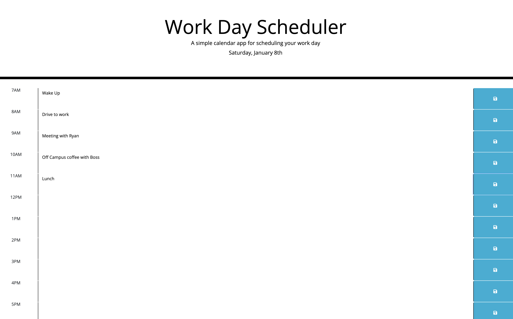
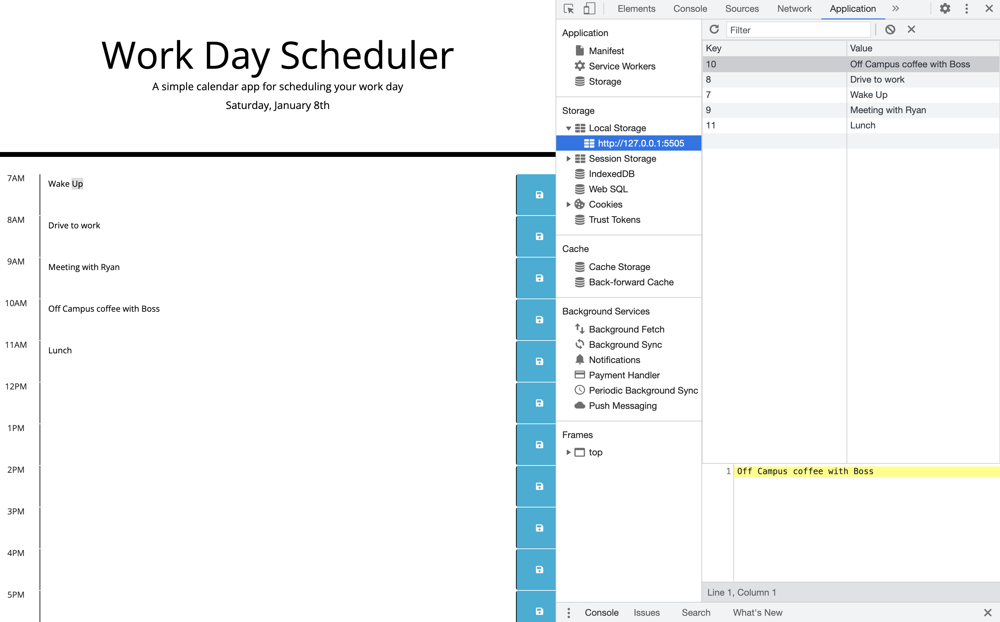

# 05 Third-Party APIs: Work Day Scheduler - Lori Timmons 

## Table of Contents 
* [Description](#Description)   
* [Installation](#Installation) 
* [Usage](#Usage) 
* [Questions / Issues](#Questions) 

  ## Description
This application is a simple calendar application that allows the user to save events for each hour of the day. This includes dynamically updated HTML and CSS.   Time blocks will change to different color based off when an item is scheduled. Past(white), present(red) and future(green).   When texted is entered in the text area it will save to local storage and remain on the page though a refresh. 
 

  ## Installation
  This project uses jQuery, CSS, JS, and [Moment.js](https://momentjs.com/) library to work with date and time. 

  ## Usage
  Use this application to keep yourself organized and on schedule for your work day. 
   
   
   

## Questions
  #### Contact Me @: lorietimmons@gmail.com 
  #### GitHub Profile: LoriTimmons
  #### GitHub Repo Link: https://github.com/LoriTimmons/05-homework
  #### Deployed Application: https://loritimmons.github.io/05-homework/

